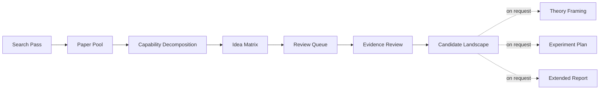
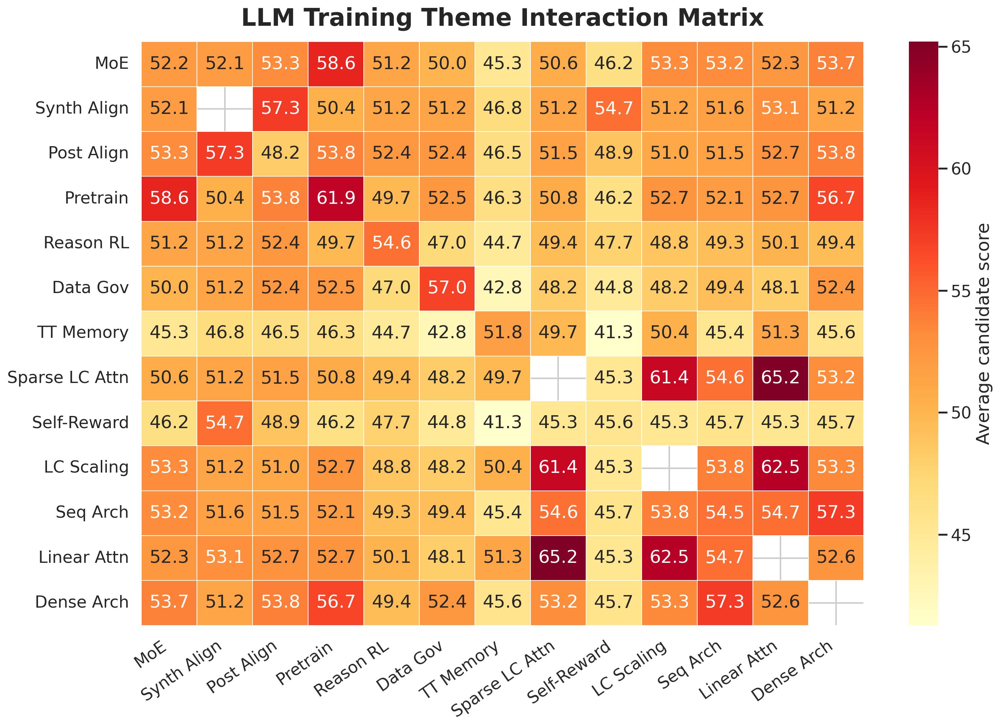
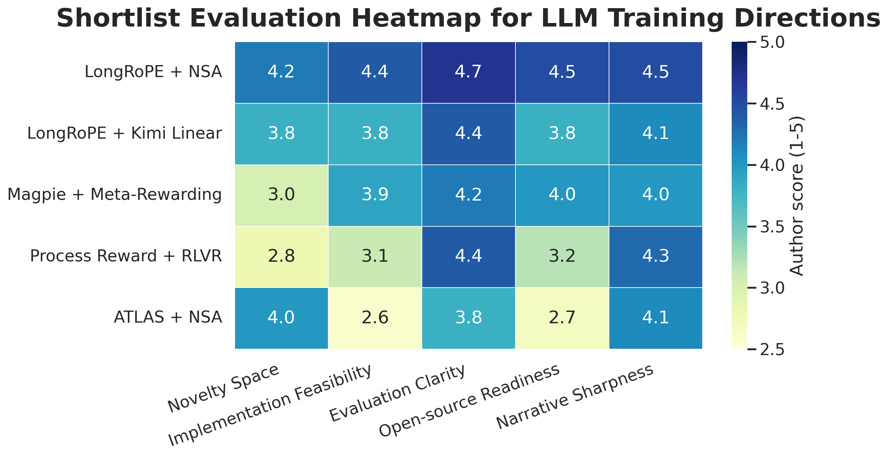

<div align="center">

# Research Innovation Explorer

**This search-first workflow turns a structured paper pool and an A+B matrix into an evidence-grounded landscape of research questions, uncertainties, and next checks for researcher review.**

[中文文档](./README.zh-CN.md)

[](https://github.com/foryourhealth111-pixel/research-innovation-explorer)
[](https://github.com/foryourhealth111-pixel/research-innovation-explorer)


<div align="center">
    
    
</div>


</div>

## Why This Exists

Most research-idea workflows fail in one of three ways:

- they rely on vague intuition instead of systematic search
- they generate combinations but cannot explain why the combination matters
- they lose the evidence and uncertainty that should guide the next research decision

`research-innovation-explorer` is built to close those gaps with one coherent workflow:

1. Search broadly and repeatedly.
2. Decompose papers into reusable capabilities.
3. Generate and rank candidate combinations for review.
4. Check both combination directions against source evidence.
5. Return a provisional candidate landscape with supporting evidence, uncertainty, and next checks.

Theory framing, experiment planning, and publication-oriented reporting remain available as explicit follow-up layers for a researcher-selected candidate.

## Core Methodology

This skill is built around one explicit research-production loop:

1. Collect roughly 40 relevant, high-quality papers with enough detail to support comparison.
2. Build a pairwise combination matrix over those papers.
3. Keep one row per unique paper pair; 40 papers produce `40 x 39 / 2 = 780` rows with the current generator.
4. Use matrix scores to build a review queue, then examine both `A -> B` and `B -> A` through focused source, prior-art, code, or benchmark checks.
5. Keep a provisional set of questions with evidence, contrary evidence, uncertainty, and recommended next actions.

This is the operational core of the workflow, not a side note. The point is not to wait for a single flash of inspiration. The point is to search comprehensively, force structured combination, validate aggressively, and only then keep the few ideas that survive contact with evidence.

| Stage | What to do | What comes out |
| --- | --- | --- |
| Paper pool | Gather around 40 relevant papers with reproducible detail | a reusable capability inventory |
| Combination pass | Enumerate every unique paper pair | 780 pair rows for a 40-paper pool |
| Post-matrix review | Check both directions, inspect evidence, and identify the highest-value unresolved question | candidate review records |
| Provisional landscape | Group promising, unresolved, parked, weak, and excluded candidates with reasons | a researcher-ready shortlist |

## What You Get

| Layer | What it does |
| --- | --- |
| `SKILL.md` | Defines the default exploration workflow, evidence rules, and optional expansion paths |
| `scripts/build_search_queries.py` | Generates structured query packs for topic scan, novelty checks, and failure analysis |
| `scripts/build_idea_matrix.py` | Builds a scored pairwise candidate matrix from the paper pool |
| `scripts/build_research_figures.py` | Generates publication-style literature heatmaps, scoring heatmaps, and analysis panels from the research artifacts |
| `scripts/build_markdown_report.py` | Scaffolds a Markdown matrix overview; reviewed evidence is added afterward |
| `references/` | Contains the search playbook, theory framing rules, reporting rules, and ethics boundaries |
| `assets/templates/` | Provides CSV, candidate-review, idea-brief, experiment-plan, and report templates |

## Workflow



## Design Principles

### 1. Search First

The skill assumes that current literature claims should not come from memory alone when search is available.

### 2. Dynamic Review

Each review round targets the uncertainty most likely to change the recommendation. Unknown, incomplete, and conflicting evidence remain visible in the output.

### 3. Evidence-Carrying Reports

The default candidate landscape includes:

- citations
- observed facts and agent inferences kept separate
- candidate comparison
- uncertainty and next checks

Matrix scores are triage signals. They do not establish novelty, feasibility, publishability, or expected research success.

### 4. Host Neutrality

The workflow is portable across different agent hosts and even manual use. The repo does not depend on one specific runtime.

## Quick Start

### 1. Prepare the search pack

```bash
python scripts/build_search_queries.py \
  --topic "long-context reasoning" \
  --keywords "memory routing, verifier head, benchmark"
```

### 2. Build the paper pool

Start from:

- `assets/templates/search-log.csv`
- `assets/templates/paper-pool.csv`

### 3. Generate the idea matrix

```bash
python scripts/build_idea_matrix.py \
  assets/templates/paper-pool.csv \
  --output work/idea-matrix.csv
```

### 4. Review candidates and optionally generate a report

After generating the matrix, copy `assets/templates/candidate-review.yaml` for candidates in the review queue. Read `references/post-matrix-review.md` and record source-linked facts, inferences, status, confidence, and next checks.

The report script remains available as a matrix-overview scaffold. Generate static figures and a Markdown overview only when they help the current review:

Generate static figures first when the final research output should include academic paper-style data visuals:

```bash
python scripts/build_research_figures.py \
  --paper-pool assets/templates/paper-pool.csv \
  --idea-matrix work/idea-matrix.csv \
  --output-dir work/figures \
  --topic "Long-Context Reasoning" \
  --prefix long_context
```

```bash
python scripts/build_markdown_report.py \
  --topic "Long-Context Reasoning" \
  --paper-pool assets/templates/paper-pool.csv \
  --idea-matrix work/idea-matrix.csv \
  --search-log assets/templates/search-log.csv \
  --figure-dir work/figures \
  --figure-prefix long_context \
  --output work/report.md
```

## Optional Report Style

The reporting layer is intentionally designed for GitHub-native reading:

- Mermaid flowcharts for process explanation
- static PNG heatmaps for matrix snapshots and worked examples
- Mermaid pie charts for quick distribution views
- Markdown evidence tables for claim tracing
- compact narrative sections for executive summary and detailed analysis

This makes an optional overview readable as a working note and a shareable artifact. The default deliverable remains the provisional candidate landscape.

## Example Output

### Exploring LLM Training Directions

This worked example uses frontier large language model training research as the target domain. It starts from a search-backed pool of roughly 40 recent papers, builds the combination matrix, and then reviews selected candidates to produce a provisional landscape with evidence and open questions.

At the survey level, the workflow turns the literature into a readable interaction matrix instead of a prose dump:



At the decision level, the workflow uses the matrix as a screening view and records source-based questions, concerns, and next checks separately:



What this example demonstrates:

- search is used during collection and during analysis, not only at the beginning
- the matrix-to-review-queue process is explicit and inspectable
- GitHub README pages and Markdown reports can show the screening logic with direct images, without depending on host-side math rendering

The bundled example images live in [`assets/examples/llm-training/`](./assets/examples/llm-training/) and can be regenerated with [`scripts/build_llm_training_example_figures.py`](./scripts/build_llm_training_example_figures.py).

## Repository Layout

```text
.
├── SKILL.md
├── README.md
├── README.zh-CN.md
├── agents/
│   └── openai.yaml
├── assets/
│   ├── examples/
│   │   └── llm-training/
│   └── templates/
├── references/
└── scripts/
    ├── build_idea_matrix.py
    ├── build_llm_training_example_figures.py
    ├── build_markdown_report.py
    ├── build_research_figures.py
    └── build_search_queries.py
```

## Recommended Use Cases

- discovering literature-grounded research questions worth further review
- mapping literature around a topic before starting implementation
- checking whether an A+B combination already exists in prior work or code
- producing a provisional candidate landscape with citations and visual summaries
- training literature review, abstraction, evaluation design, and research writing habits

## Documentation

- Core workflow: [`SKILL.md`](./SKILL.md)
- Search protocol: [`references/search-playbook.md`](./references/search-playbook.md)
- Post-matrix review: [`references/post-matrix-review.md`](./references/post-matrix-review.md)
- Candidate template: [`assets/templates/candidate-review.yaml`](./assets/templates/candidate-review.yaml)
- Theory framing: [`references/framing-and-theory.md`](./references/framing-and-theory.md)
- Reporting rules: [`references/reporting-and-visualization.md`](./references/reporting-and-visualization.md)
- Report template: [`assets/templates/analysis-report-template.md`](./assets/templates/analysis-report-template.md)

## Notes

- If your host cannot render Mermaid, keep the Markdown tables and replace Mermaid blocks with static images or plain-text summaries.
- If your host has no search capability, use the workflow manually and explicitly downgrade confidence in current-literature claims.

## Community

For broader discussion around tools, workflows, and AI-native building, visit [linux.do](https://linux.do/).

## License

This repository is released under the [MIT License](./LICENSE).
