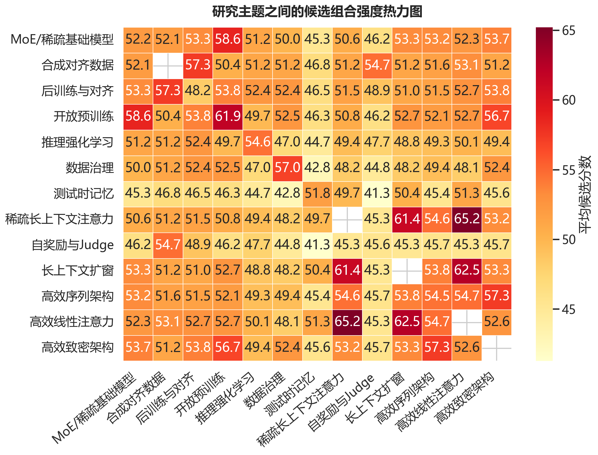
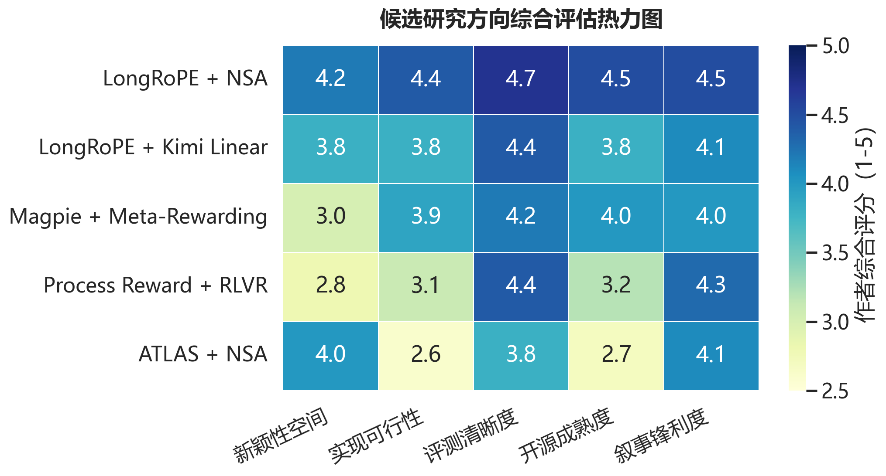

<div align="center">

# Research Innovation Explorer

**一个宿主中立、搜索优先的研究创新点探索技能，用于文献驱动的 idea 发现、理论包装与高质量 Markdown 报告生成。**

[English README](./README.md)

[](https://github.com/foryourhealth111-pixel/research-innovation-explorer)
[](https://github.com/foryourhealth111-pixel/research-innovation-explorer)


<div align="center">
  
  
</div>

</div>


## 这个仓库解决什么问题

很多“找创新点”的流程会卡在三件事上：

- 只靠印象找论文，没有系统检索
- 能拼组合，但讲不清为什么这个组合成立
- 做完分析后没有形成可读、可分享、可追溯的报告

`research-innovation-explorer` 的设计目标，就是把这三件事接起来：

1. 先做系统搜索，再做判断。
2. 把论文拆成可复用能力，而不是只看标题。
3. 生成并筛选组合候选。
4. 对最强候选做诚实的理论表达。
5. 最终输出一份优雅的 Markdown 报告，包含参考文献、分析依据和可视化摘要。

## 核心方法学

这个技能围绕一条非常明确的研究生产链条展开：

1. 先收集大约 40 篇最新的、顶会的、Oral 级别的、开源的、业界认可的优质论文。
2. 以这些论文为基础，建立一个方向敏感的 `40 x 40` 组合矩阵。
3. 去掉自己和自己的对角线组合，保留剩余的 `40 x 39 = 1560` 种 `A + B` 可能。
4. 对这 1560 个候选做快速逻辑验证、轻量实验验证，以及有针对性的搜索补充。
5. 基于搜索到的信息和验证结果，把空间收缩到大约 15 个真正靠谱、能跑通、值得继续推进的 Idea。

这不是工作流边缘上的一个小技巧，而是整个技能的操作核心。重点不是等待“灵光一现”，而是先做足搜索，再强制组合，再快速验证，最后只保留那些经得起信息和证据筛选的少数候选。

| 阶段 | 要做什么 | 产出什么 |
| --- | --- | --- |
| 论文池 | 收集约 40 篇有代码、有影响力的近期强论文 | 一份可复用的能力清单 |
| 组合阶段 | 穷举 `40 x 40` 空间并移除自组合 | 1560 个方向敏感的 `A + B` 候选 |
| 快速验证 | 搜索相关工作、检查代码、做快速逻辑判断或最小实验 | 一批更现实的可行选项 |
| 最终筛选 | 只保留兼具新颖性、逻辑一致性和可实现性的组合 | 大约 15 个可推进的 Idea |

## 你会得到什么

| 层级 | 作用 |
| --- | --- |
| `SKILL.md` | 定义完整流程、判断规则与交付要求 |
| `scripts/build_search_queries.py` | 生成主题扫描、新颖性检查、失败分析等查询包 |
| `scripts/build_idea_matrix.py` | 从论文池生成组合候选矩阵并评分 |
| `scripts/build_research_figures.py` | 从研究产物生成论文风格的文献热力图、评分热力图和分析面板图 |
| `scripts/build_markdown_report.py` | 生成带 Mermaid 图、证据表和参考文献的 Markdown 报告草稿 |
| `references/` | 放置搜索手册、理论表达规则、报告规范和边界约束 |
| `assets/templates/` | 提供搜索日志、论文池、idea brief、实验计划和报告模板 |

## 工作流


## 设计原则

### 1. 搜索优先

只要当前环境具备搜索能力，就不应该仅凭记忆去做“最新文献”判断。

### 2. 理论表达要诚实

这个技能支持统一框架、极端特例、控制变量等写法，但前提是这些表达真的能被定义、解释和验证。

### 3. 报告要带证据

最终输出的 Markdown 文档不只是“结论合集”，而是必须包含：

- 参考文献
- 分析依据
- 候选比较
- 可视化摘要

### 4. 宿主中立

这里沉淀的是工作流本身，而不是某一个 agent 平台的专属写法。无论是支持 Skills 的宿主，还是手工执行，都可以复用。

## 快速开始

### 1. 先生成查询包

```bash
python scripts/build_search_queries.py \
  --topic "long-context reasoning" \
  --keywords "memory routing, verifier head, benchmark"
```

### 2. 准备论文池

从这些模板开始：

- `assets/templates/search-log.csv`
- `assets/templates/paper-pool.csv`

### 3. 生成组合矩阵

```bash
python scripts/build_idea_matrix.py \
  assets/templates/paper-pool.csv \
  --output work/idea-matrix.csv
```

### 4. 生成 Markdown 报告

如果最终研究输出需要学术论文风格的数据图，先生成静态图表：

```bash
python scripts/build_research_figures.py \
  --paper-pool assets/templates/paper-pool.csv \
  --idea-matrix work/idea-matrix.csv \
  --output-dir work/figures \
  --topic "Long-Context Reasoning" \
  --prefix long_context
```

```bash
python scripts/build_markdown_report.py \
  --topic "Long-Context Reasoning" \
  --paper-pool assets/templates/paper-pool.csv \
  --idea-matrix work/idea-matrix.csv \
  --search-log assets/templates/search-log.csv \
  --figure-dir work/figures \
  --figure-prefix long_context \
  --output work/report.md
```

## 输出风格

报告层默认采用 GitHub 友好的视觉结构：

- Mermaid 流程图，用来解释流程与逻辑
- 静态 PNG 热力图，用来稳定展示矩阵快照和真实用例
- Mermaid 饼图，用来快速展示分布
- Markdown 证据表，用来承载“分析依据”
- 简洁段落，用来承载 summary 和 detailed analysis

这样既适合工作中快速阅读，也适合作为可分享的研究 memo。

## 使用示例

### 研究大语言模型训练方向

这个用例把“大语言模型训练前沿”作为目标主题。流程从大规模搜索开始，先收集大约 40 篇最新的、顶会的、Oral 级别的、开源的、业界认可的优质论文，建立一个方向敏感的 `40 x 40` 组合矩阵，移除对角线之后得到 `1560` 个 `A + B` 候选，再通过搜索补充、代码检查和轻量验证把空间压缩到最终 shortlist。

在综述层，工作流会先把文献空间变成可读的主题交互矩阵，而不是只给一堆论文标题：



在决策层，工作流再把最终 shortlist 压缩成一个结果矩阵，把新颖性空间、实现可行性、评测清晰度、开源成熟度和叙事锋利度直接摊开：



这个用例想表达的重点是：

- 搜索不只是前置动作，在分析阶段也会持续使用
- `40 x 40 -> 1560 -> ~15` 的收缩过程是显式的、可复查的
- GitHub README 和 Markdown 报告可以直接用图片承载筛选逻辑，不依赖宿主侧的数学渲染

仓库内置的示例图片位于 [`assets/examples/llm-training/`](./assets/examples/llm-training/)，英文版图片可通过 [`scripts/build_llm_training_example_figures.py`](./scripts/build_llm_training_example_figures.py) 重新生成。

## 仓库结构

```text
.
├── SKILL.md
├── README.md
├── README.zh-CN.md
├── agents/
│   └── openai.yaml
├── assets/
│   ├── examples/
│   │   └── llm-training/
│   └── templates/
├── references/
└── scripts/
    ├── build_idea_matrix.py
    ├── build_llm_training_example_figures.py
    ├── build_markdown_report.py
    ├── build_research_figures.py
    └── build_search_queries.py
```

## 适用场景

- 挖掘增量但可辩护的研究创新点
- 在真正动手实现之前，先把文献图谱拉清楚
- 检查某个 A+B 组合是否已经在论文或代码里出现过
- 输出一份高质量、带引用、带可视化的研究分析文档
- 训练文献检索、方法抽象、实验设计和研究写作能力

## 文档入口

- 主流程：[`SKILL.md`](./SKILL.md)
- 搜索手册：[`references/search-playbook.md`](./references/search-playbook.md)
- 理论表达：[`references/framing-and-theory.md`](./references/framing-and-theory.md)
- 报告规范：[`references/reporting-and-visualization.md`](./references/reporting-and-visualization.md)
- 报告模板：[`assets/templates/analysis-report-template.md`](./assets/templates/analysis-report-template.md)

## 说明

- 如果宿主不能渲染 Mermaid，就保留 Markdown 表格，并把 Mermaid 替换成静态图片或纯文本摘要。
- 如果当前环境没有搜索能力，可以手工执行这套流程，但应明确降低对“当前文献结论”的置信度。

## 社区

如果你希望参与更广泛的工具、工作流和 AI 原生构建讨论，可以访问 [linux.do](https://linux.do/)。

## 许可证

本仓库采用 [MIT License](./LICENSE) 开源发布。
