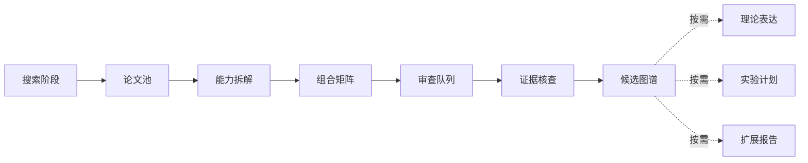
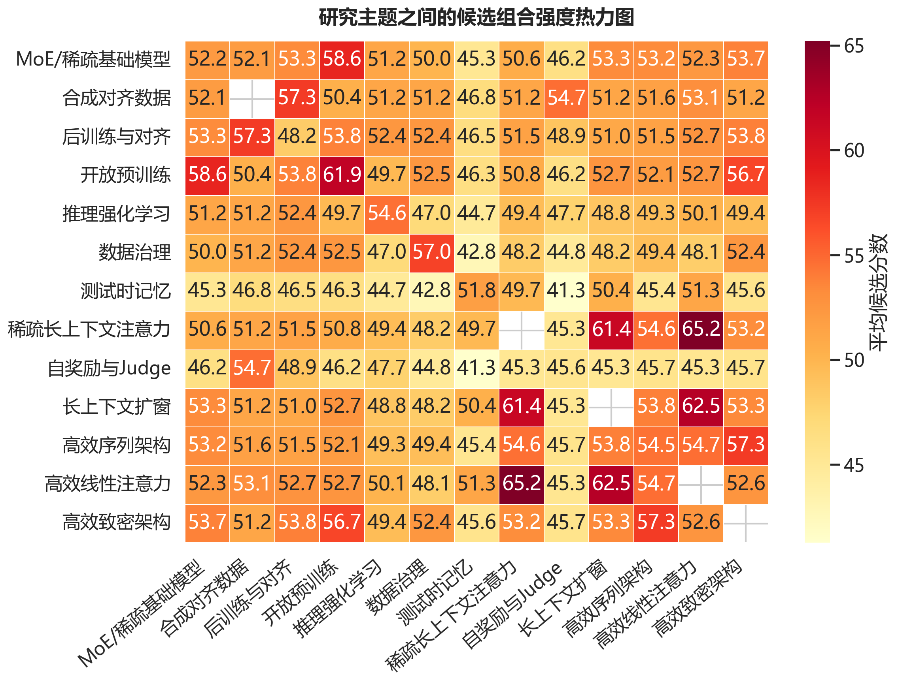
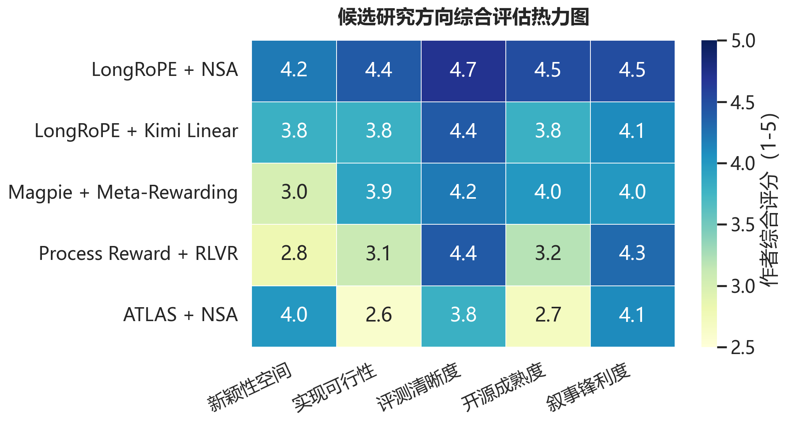

<div align="center">

# Research Innovation Explorer

**这套搜索优先的工作流从结构化论文池和 A+B 组合矩阵出发，为研究人员整理候选问题、证据、不确定性和下一步核查建议。**

[English README](./README.md)

[](https://github.com/foryourhealth111-pixel/research-innovation-explorer)
[](https://github.com/foryourhealth111-pixel/research-innovation-explorer)


<div align="center">
  
  
</div>

</div>


## 这个仓库解决什么问题

很多“找创新点”的流程会卡在三件事上：

- 只靠印象找论文，没有系统检索
- 能拼组合，但讲不清为什么这个组合成立
- 分析过程缺少可追溯证据和明确的下一步判断依据

`research-innovation-explorer` 用一条连贯工作流处理这些问题：

1. 先做系统搜索，再开展判断。
2. 把论文拆成可复用能力，并保留论文原文依据。
3. 生成组合矩阵并安排候选审查顺序。
4. 分别核查两个组合方向。
5. 输出暂定候选图谱，展示支持证据、不确定性和下一步动作。

研究人员选定候选后，可以继续请求理论表达、实验计划或面向发表的扩展报告。

## 核心方法学

这个技能围绕一条明确的研究问题筛选链条展开：

1. 收集大约 40 篇相关且信息充分的优质论文。
2. 以这些论文为基础，建立两两组合矩阵。
3. 当前生成器为每个唯一论文对保留一行，40 篇论文会产生 `40 x 39 / 2 = 780` 行。
4. 用矩阵分数安排审查顺序，再分别核查 `A -> B` 和 `B -> A`。
5. 根据原文、相近工作、代码和评测信息，形成带证据与疑问的暂定候选集。

组合矩阵是整个技能的操作核心。工作流先做搜索和结构化组合，再由 Agent 针对最关键的疑问逐轮核查，研究人员据此选择值得继续投入的方向。

| 阶段 | 要做什么 | 产出什么 |
| --- | --- | --- |
| 论文池 | 收集约 40 篇相关且信息充分的论文 | 一份可复用的能力清单 |
| 组合阶段 | 穷举每个唯一论文对 | 40 篇论文对应 780 行组合 |
| 矩阵后审查 | 检查两个方向、核对证据并定位最关键疑问 | 候选审查记录 |
| 暂定候选图谱 | 按有潜力、待核查、矛盾、暂存、较弱和排除分组 | 供研究人员判断的候选清单 |

## 你会得到什么

| 层级 | 作用 |
| --- | --- |
| `SKILL.md` | 定义默认探索流程、证据规则和可选扩展路径 |
| `scripts/build_search_queries.py` | 生成主题扫描、新颖性检查、失败分析等查询包 |
| `scripts/build_idea_matrix.py` | 从论文池生成组合候选矩阵并评分 |
| `scripts/build_research_figures.py` | 从研究产物生成论文风格的文献热力图、评分热力图和分析面板图 |
| `scripts/build_markdown_report.py` | 生成矩阵概览草稿，后续再补入候选审查证据 |
| `references/` | 放置搜索手册、理论表达规则、报告规范和边界约束 |
| `assets/templates/` | 提供搜索日志、论文池、候选审查、idea brief、实验计划和报告模板 |

## 工作流


```mermaid
flowchart LR
    A[搜索阶段] --> B[论文池]
    B --> C[能力拆解]
    C --> D[组合矩阵]
    D --> E[审查队列]
    E --> F[证据核查]
    F --> G[候选图谱]
    G -. 按需 .-> H[理论表达]
    G -. 按需 .-> I[实验计划]
    G -. 按需 .-> J[扩展报告]
```

## 设计原则

### 1. 搜索优先

只要当前环境具备搜索能力，就不应该仅凭记忆去做“最新文献”判断。

### 2. 动态审查

每轮审查只处理一个最可能改变推荐结果的疑问。未知、证据不足和信息矛盾都会保留在结果中。

### 3. 报告要带证据

默认候选图谱包含：

- 参考文献
- 相互分离的原文事实与 Agent 推断
- 候选比较
- 不确定性和下一步核查

矩阵分数只用于安排审查顺序。新颖性、可行性、可发表性和研究成功仍需独立验证。

### 4. 宿主中立

这里沉淀的是可跨平台复用的工作流。支持 Skills 的宿主和手工执行环境都可以使用。

## 快速开始

### 1. 先生成查询包

```bash
python scripts/build_search_queries.py \
  --topic "long-context reasoning" \
  --keywords "memory routing, verifier head, benchmark"
```

### 2. 准备论文池

从这些模板开始：

- `assets/templates/search-log.csv`
- `assets/templates/paper-pool.csv`

### 3. 生成组合矩阵

```bash
python scripts/build_idea_matrix.py \
  assets/templates/paper-pool.csv \
  --output work/idea-matrix.csv
```

### 4. 审查候选，并按需生成报告

生成矩阵后，为审查队列中的候选复制 `assets/templates/candidate-review.yaml`。阅读 `references/post-matrix-review.md`，记录带来源定位的事实、推断、状态、置信度和下一步核查。

报告脚本继续作为矩阵概览工具。当前审查需要图表或 Markdown 概览时，可以运行：

如果最终研究输出需要学术论文风格的数据图，先生成静态图表：

```bash
python scripts/build_research_figures.py \
  --paper-pool assets/templates/paper-pool.csv \
  --idea-matrix work/idea-matrix.csv \
  --output-dir work/figures \
  --topic "Long-Context Reasoning" \
  --prefix long_context
```

```bash
python scripts/build_markdown_report.py \
  --topic "Long-Context Reasoning" \
  --paper-pool assets/templates/paper-pool.csv \
  --idea-matrix work/idea-matrix.csv \
  --search-log assets/templates/search-log.csv \
  --figure-dir work/figures \
  --figure-prefix long_context \
  --output work/report.md
```

## 可选报告样式

可选报告采用 GitHub 友好的视觉结构：

- Mermaid 流程图，用来解释流程与逻辑
- 静态 PNG 热力图，用来稳定展示矩阵快照和真实用例
- Mermaid 饼图，用来快速展示分布
- Markdown 证据表，用来承载“分析依据”
- 简洁段落，用来承载 summary 和 detailed analysis

这种形式适合快速阅读和分享。默认交付仍然是暂定候选图谱。

## 使用示例

### 研究大语言模型训练方向

这个用例把“大语言模型训练前沿”作为目标主题。流程从大规模搜索开始，建立论文池和组合矩阵，再从矩阵中选择候选进行证据核查，最后形成带疑问和下一步建议的暂定候选图谱。

在综述层，工作流会把论文标题和关系整理成可读的主题交互矩阵：



在决策层，矩阵图承担初筛展示，候选的新颖性风险、实现摩擦和证据缺口由独立审查记录承载：



这个用例想表达的重点是：

- 搜索不只是前置动作，在分析阶段也会持续使用
- 从组合矩阵到审查队列的过程是显式的、可复查的
- GitHub README 和 Markdown 报告可以直接用图片承载筛选逻辑，不依赖宿主侧的数学渲染

仓库内置的示例图片位于 [`assets/examples/llm-training/`](./assets/examples/llm-training/)，英文版图片可通过 [`scripts/build_llm_training_example_figures.py`](./scripts/build_llm_training_example_figures.py) 重新生成。

## 仓库结构

```text
.
├── SKILL.md
├── README.md
├── README.zh-CN.md
├── agents/
│   └── openai.yaml
├── assets/
│   ├── examples/
│   │   └── llm-training/
│   └── templates/
├── references/
└── scripts/
    ├── build_idea_matrix.py
    ├── build_llm_training_example_figures.py
    ├── build_markdown_report.py
    ├── build_research_figures.py
    └── build_search_queries.py
```

## 适用场景

- 发现有文献依据、值得继续核查的研究问题
- 在真正动手实现之前，先把文献图谱拉清楚
- 检查某个 A+B 组合是否已经在论文或代码里出现过
- 输出带引用、疑问和下一步核查建议的暂定候选图谱
- 训练文献检索、方法抽象、实验设计和研究写作能力

## 文档入口

- 主流程：[`SKILL.md`](./SKILL.md)
- 搜索手册：[`references/search-playbook.md`](./references/search-playbook.md)
- 矩阵后审查：[`references/post-matrix-review.md`](./references/post-matrix-review.md)
- 候选模板：[`assets/templates/candidate-review.yaml`](./assets/templates/candidate-review.yaml)
- 理论表达：[`references/framing-and-theory.md`](./references/framing-and-theory.md)
- 报告规范：[`references/reporting-and-visualization.md`](./references/reporting-and-visualization.md)
- 报告模板：[`assets/templates/analysis-report-template.md`](./assets/templates/analysis-report-template.md)

## 说明

- 如果宿主不能渲染 Mermaid，就保留 Markdown 表格，并把 Mermaid 替换成静态图片或纯文本摘要。
- 如果当前环境没有搜索能力，可以手工执行这套流程，但应明确降低对“当前文献结论”的置信度。

## 社区

如果你希望参与更广泛的工具、工作流和 AI 原生构建讨论，可以访问 [linux.do](https://linux.do/)。

## 许可证

本仓库采用 [MIT License](./LICENSE) 开源发布。
