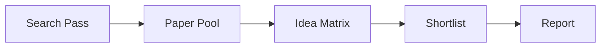

# Research Innovation Report: <topic>

## Executive Summary

-

## Visual Overview

## Post-Research Figures

## Search Strategy

-

## Candidate Landscape

| Rank | Candidate | Score | Why It Survived | Refs |
| --- | --- | --- | --- | --- |
| 1 |  |  |  |  |

## Recommended Direction

-

## Analysis Basis

| Claim | Basis | Support |
| --- | --- | --- |
|  |  |  |

## Detailed Analysis

### Why the top candidate is interesting

-

### What could invalidate it

-

### What to verify next

-

## References

- [R1]
