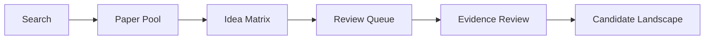

# Research Question Candidate Landscape: <topic>

> Provisional screening artifact for researcher review.

## Executive Summary

- Review coverage:
- Most promising questions:
- Main unresolved uncertainty:
- Recommended researcher action:

## Visual Overview

```mermaid
flowchart LR
    A[Search] --> B[Paper Pool]
    B --> C[Idea Matrix]
    C --> D[Review Queue]
    D --> E[Evidence Review]
    E --> F[Candidate Landscape]
```

## Review Coverage

| Item | Coverage | Limitation |
| --- | --- | --- |
| Paper pool |  |  |
| Matrix candidates |  |  |
| Reviewed candidates |  |  |
| Source access |  |  |

Matrix scores below are queue-priority signals. Qualitative statuses come from source-based candidate review.

## Priority Candidates

| Candidate | Matrix Score | Status | Confidence | Possible Question | Evidence Basis | Closest Concern | Next Check |
| --- | ---: | --- | --- | --- | --- | --- | --- |
|  |  | promising |  |  |  |  |  |

## Needs Check and Conflicting Evidence

| Candidate | Matrix Score | Status | Key Uncertainty or Conflict | Current Evidence | Next Check |
| --- | ---: | --- | --- | --- | --- |
|  |  | needs_check |  |  |  |

## Parked, Weak, and Excluded Candidates

| Candidate | Matrix Score | Status | Status Reason | Reopen When |
| --- | ---: | --- | --- | --- |
|  |  |  |  |  |

## Detailed Candidate Evidence

### <candidate_id>

- Paper A:
- Paper B:
- Selected direction:
- Selection basis:
- Status and confidence:
- Status basis:

#### Direction Checks

| Direction | Assessment | Possible Question | Key Uncertainty | Supporting Inferences |
| --- | --- | --- | --- | --- |
| A to B |  |  |  |  |
| B to A |  |  |  |  |

#### Observed Facts

| Fact ID | Statement | Source | Locator |
| --- | --- | --- | --- |
| F1 |  |  |  |

#### Agent Inferences

| Inference ID | Interpretation | Supporting Facts |
| --- | --- | --- |
| I1 |  | F1 |

#### Open Decision

- Closest concern:
- Key uncertainty:
- Next check:

## References

- [R1]
